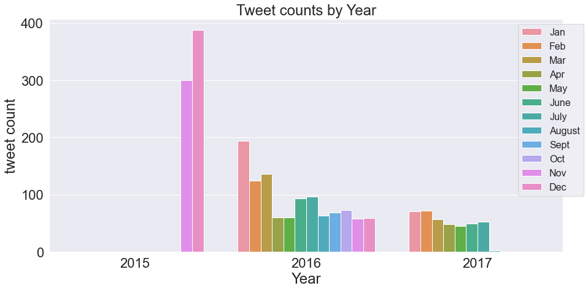

# Twitter_dog_ratings_analysis
# By (Okolo Uchenna)

## Dataset
WeRateDogs is a Twitter account that rates people's dogs with a humorous comment about the dog.
These ratings almost always have a denominator of 10. The numerators, though?
Almost always greater than 10. 11/10, 12/10, 13/10, etc. Why? Because <a href="http://knowyourmeme.com/memes/theyre-good-dogs-brent">they're good dogs Brent."</a>
WeRateDogs has over 4 million followers and has received international media coverage.

<h2>WeRateDog twitter handle data wrangling and analysis</h2>
<ul>
  <li>wrangling involved web scraping with twitterApi including dowloadable file provided by Udacity.</li>
  <li>Analysis and visualization utilized python, pandas, matplotlib, seaborn, numpy......</li>
</ul>
There were three (3) different dataFrames needed to carry out this ananlysis; twitter_archive_enhanced csv file, image_prediction tsv file and tweet_jason txt file. Udacity provided the twitter_archive as a downloadable file. Using the requests module together with the link provided by Udacity, i used the get function to download the image prediction file and then register for twitter students developer account for assess keys that was used to query twitter API for the jason file containing each tweet's retweet_count and favorites count.

<h2>Summary</h2>
2016 recorded the highest tweet volume, While its monthly tweet activities appeared to be less than the only two monthly activities present in 2015. With respect to monthly tweets, 2015 recorded the 2 highest tweets in November and December which surpasses every other month across the three year period presented in the data. November with 300 tweets, while December boasts of 388 tweets being the highest monthly tweet activity.

The average retweet_counts and favorite_counts are approximately 2225 and 7544 respectively. Atticus, the dog with the highest rating of 1776/10 appear to have an above average retweets, but well below average likes. It also falls significatly below the winning dog on likes and retweets which ironically has a 13/10 numerator rating compared to Atticus'. The dog with the highest likes and retweets is a Labrador retriever belonging to the doggo dog_stage and famously known for having their lives in order. It's also rumoured that they understed their taxes🤣🤣🤣.

